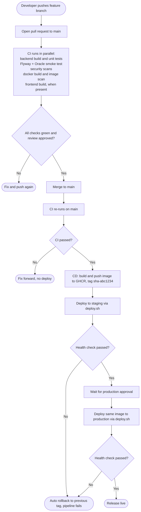
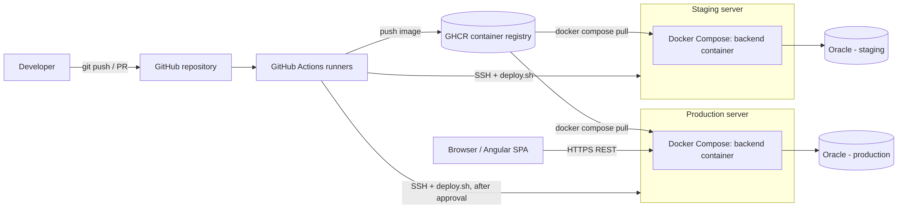
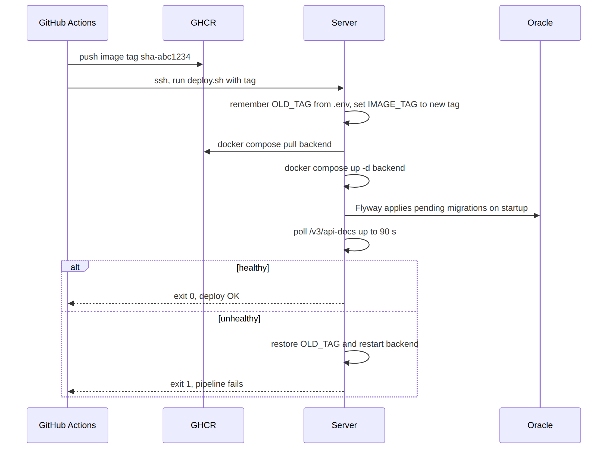
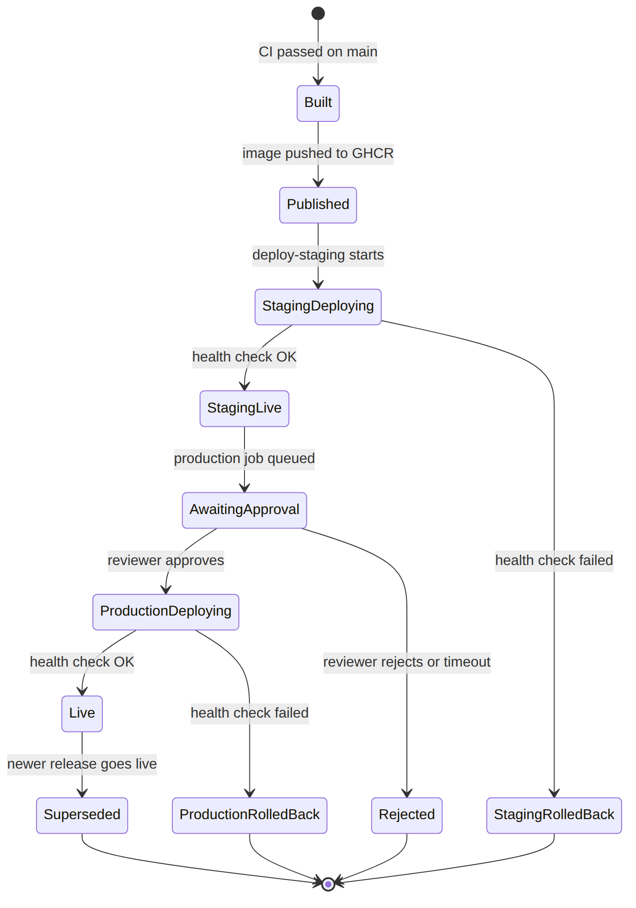
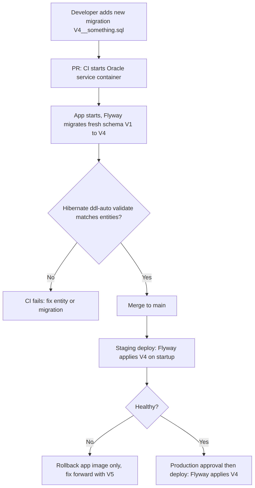

# OrderCraft — CI/CD Documentation

| | |
|---|---|
| **Project** | OrderCraft — Manufacturing Order Management System |
| **Document version** | 1.0 (draft) |
| **Date** | 30 Sep 2026 |
| **Based on** | `README.md`, `PROJECT_MODULES.md`, `pom.xml`, `application.yml`, `application-test.yml`, `SecurityConfig.java`, Flyway migrations V1–V3 |
| **Assumptions** | GitHub + GitHub Actions, GHCR as the image registry, and a single Docker host per environment. The repo does not say where it is hosted or deployed, so all three are **[Assumption]**. |

The pipeline files described here are shipped next to this document in `repo-files/`, laid out exactly as they should sit in the repository. The full text of each file is also in the appendix.

---

## 1. Purpose and scope

This document defines how OrderCraft code moves from a developer's branch to production: what is checked on every pull request (CI), how a merged change is packaged and released (CD), how database migrations, configuration and secrets are handled, and how to roll back.

It covers the Spring Boot backend, which is what exists today, and leaves hooks for the Angular frontend, which is specified but not yet built.

## 2. Current state of the repository

Findings from the uploaded archive. This is what the pipeline has to work with.

| Area | Finding | Consequence for CI/CD |
|---|---|---|
| Build | Maven, Java 17, Spring Boot 3.3.4, artifact `ordercraft-backend-0.0.1-SNAPSHOT.jar` | Pipeline pins JDK 17 (Temurin) |
| Maven wrapper | No `mvnw` in the archive | CI uses the runner's Maven; adding the wrapper is recommended (section 13) |
| Tests | Dependencies (JUnit 5/Mockito via `spring-boot-starter-test`, H2, Spring Security test) and an `application-test.yml` exist, but **no `src/test` folder** | The unit-test gate passes with zero tests today; it becomes meaningful as tests are added |
| Test profile | H2 in memory, `ddl-auto: create-drop`, **Flyway disabled** | The Oracle migrations are not exercised by unit tests, so a separate Oracle job is required |
| Prod profile | `ddl-auto: validate`, Flyway enabled on startup, `baseline-on-migrate: true` | Schema drift fails startup, which the Oracle job uses as a check |
| Database | Oracle 21c XE, service `XEPDB1`, image `gvenzl/oracle-xe:21-slim` | Same image is used as a CI service container |
| Docker | README mentions `docker-compose.yml`, but **no Dockerfile or compose file** is in the archive | Both are provided in `repo-files/` |
| CI/CD | No `.github/`, no pipeline files of any kind | Everything here is new |
| Health endpoint | No Spring Actuator dependency | Health checks use the public `/v3/api-docs` for now (section 10) |
| Public endpoints | `/api/auth/login`, `/api/auth/refresh`, `/swagger-ui/**`, `/v3/api-docs/**` | Used by smoke tests |
| Frontend | `ordercraft-frontend/` is listed as "upcoming" | A frontend job exists but skips itself until `package.json` appears |
| `.gitignore` | Not present in the archive | Make sure `target/` and `.env` are ignored |

## 3. Pipeline at a glance



| Stage | Trigger | Output |
|---|---|---|
| **CI** (`ci.yml`) | Every PR to `main`, every push to `main` | Pass/fail status checks, test reports, jar artifact |
| **CD: publish** (`cd.yml`) | CI finished successfully on `main` | Docker image in GHCR tagged `sha-<7 chars>` and `main` |
| **CD: staging** | After publish | Staging running the new image |
| **CD: production** | After staging is healthy **and** a reviewer approves | Production running the same image |
| **Rollback** (`rollback.yml`) | Manual | Any previous image tag redeployed to the chosen environment |

Principle: **build once, deploy the same image everywhere.** Only configuration differs between environments.

## 4. Branching, pull requests and versioning

- **Trunk-based flow.** `main` is always releasable. Work happens on short-lived branches such as `feature/customer-module` and merges by pull request.
- **Branch protection on `main`:** require a PR, at least one approval, all status checks below, up-to-date branch, no force pushes.
- **Required status checks:** `Backend build and unit tests`, `Flyway + Oracle smoke test`, `Security scans`, `Docker image builds`, `Frontend build and tests (when present)`.
- **Image tags:** `sha-<short commit>` is the immutable release identifier used for deploys and rollbacks; `main` is a moving convenience tag. Semantic version tags (`v1.2.0`) can be added later by extending `cd.yml` with a `tags: ['v*']` trigger.
- **Commit messages:** any convention works; Conventional Commits (`feat:`, `fix:`) make a future automated changelog possible.

## 5. Continuous integration

Defined in `.github/workflows/ci.yml`. Jobs `backend-test`, `security`, and `frontend` start immediately; `oracle-integration` and `docker-build` wait for `backend-test`.

| Job | What it does | Fails the build when |
|---|---|---|
| **backend-test** | JDK 17, Maven cache, `mvn verify` with `SPRING_PROFILES_ACTIVE=test`; uploads surefire reports and the jar | Compilation or any test fails |
| **oracle-integration** | Starts an Oracle XE service container, runs the built jar against it (Flyway migrates, Hibernate validates the schema), waits for `/v3/api-docs`, logs in as the seeded admin and checks a token comes back | App does not start, a migration fails, entities do not match the schema, or login fails |
| **security** | Gitleaks secret scan, Trivy filesystem scan (dependencies), CodeQL analysis for Java | Secret found, HIGH/CRITICAL fixable vulnerability, or CodeQL alert policy trips |
| **docker-build** | Builds the backend image without pushing, then scans it with Trivy | Image does not build or has a CRITICAL fixable vulnerability |
| **frontend** | Detects `ordercraft-frontend/package.json`. If present: `npm ci`, lint, Karma tests in headless Chrome, production build. Otherwise skips | Lint, tests or build fail |

Notes:

- `concurrency` cancels superseded runs on the same branch to save minutes.
- Workflow permissions default to read-only; only the jobs that need more ask for it.
- The Oracle container takes a minute or two to become healthy. The service definition waits for its health check before the steps run.
- Karma in CI usually needs a headless launcher with `--no-sandbox`. Add a `ChromeHeadlessCI` custom launcher in `karma.conf.js` when the frontend exists and point `--browsers` at it.

## 6. Continuous delivery

Defined in `.github/workflows/cd.yml` and `deploy/`.



1. **Trigger.** `cd.yml` runs when the `CI` workflow completes on `main`, and continues only if it succeeded. It checks out the exact commit CI tested (`head_sha`), so deployed code is always the code that passed.
2. **Publish.** Builds the backend image, pushes `ghcr.io/<owner>/ordercraft-backend:sha-<short>` and `:main`.
3. **Staging.** The job (bound to the `staging` GitHub environment) SSHes to the server and runs `deploy/deploy.sh <tag>`.
4. **Production.** Bound to the `production` environment, which must have **required reviewers** configured, so the job pauses until someone approves. It then deploys the same tag the same way.

### 6.1 The deploy script



`deploy/deploy.sh` runs on the target server and:

1. reads the current `IMAGE_TAG` from `/opt/ordercraft/.env` (this is the rollback target),
2. writes the new tag, pulls the image, and restarts the `backend` service,
3. polls `http://localhost:8080/v3/api-docs` for up to 90 seconds,
4. on success exits 0 and prunes old images; on failure prints the last 100 log lines, restores the old tag, restarts, and exits 1 so the pipeline goes red.

### 6.2 Release lifecycle



### 6.3 Environments

| | Local | CI (ephemeral) | Staging | Production |
|---|---|---|---|---|
| **Purpose** | Development | Verify every PR | Pre-production check | Live |
| **How it runs** | `mvn spring-boot:run` or root `docker-compose.yml` | GitHub runner + Oracle service container | Docker Compose on a server (`deploy/docker-compose.yml`) | Same as staging |
| **Database** | Oracle XE in Docker | Oracle XE service container, discarded after the run | Separate Oracle instance | Separate, supported/managed Oracle (XE limits apply) |
| **Config source** | `application.yml` defaults | Env vars in the workflow | `/opt/ordercraft/.env` on the server | `/opt/ordercraft/.env` on the server |
| **Deploy trigger** | Manual | Automatic (per PR) | Automatic after merge | Manual approval |
| **JWT secret** | Local dev value | Random per run (`openssl rand -hex 32`) | Unique, stored on server | Unique, stored on server |

## 7. Database migrations



Rules:

1. **Flyway owns the schema.** Hibernate runs in `validate` mode, so it never changes tables.
2. **Never edit an applied migration** (V1–V3 or any later one once merged). Add the next version (`V4__...sql`). Editing changes the checksum and breaks startup everywhere it was already applied.
3. **Migrations run on application startup**, so deploying a new image applies them. This is simple and fits a single-instance deployment. If you later run multiple replicas, move migration to a one-off pre-deploy job.
4. **Keep migrations backward compatible for one release** (add columns and tables first, drop or rename in a later release), so an application rollback still works against the newer schema.
5. **Flyway Community has no undo.** Roll back the application image, and fix the schema forward with a new migration.
6. **Back up production before deploys that include migrations** (export or RMAN, whichever your DBA uses). The pipeline does not do this yet.

## 8. Configuration and secrets

Spring maps environment variables onto properties, so no code change is needed.

| Environment variable | Property | Notes |
|---|---|---|
| `SPRING_DATASOURCE_URL` | `spring.datasource.url` | e.g. `jdbc:oracle:thin:@dbhost:1521/XEPDB1` |
| `SPRING_DATASOURCE_USERNAME` | `spring.datasource.username` | Dedicated app user, not SYS/SYSTEM |
| `SPRING_DATASOURCE_PASSWORD` | `spring.datasource.password` | Secret |
| `JWT_SECRET` | `app.jwt.secret` | Secret. Read as raw UTF-8 bytes for HS256, so it must be at least 32 characters. `openssl rand -hex 32` gives 64 |
| `APP_CORS_ALLOWED_ORIGINS` | `app.cors.allowed-origins` | Comma separated, must match the frontend URL |
| `SPRING_PROFILES_ACTIVE` | — | `test` only in CI unit tests. Never in staging/production |
| `JAVA_OPTS` | — | JVM flags; image default is `-XX:MaxRAMPercentage=75` |

**Where secrets live**

| Secret | Location |
|---|---|
| `DEPLOY_HOST`, `DEPLOY_USER`, `DEPLOY_SSH_KEY` | GitHub **environment** secrets, defined separately for `staging` and `production` under the same names |
| Registry login | The built-in `GITHUB_TOKEN` with `packages: write` on the publish job only |
| DB password, `JWT_SECRET`, CORS origins | `/opt/ordercraft/.env` on each server, mode 600, never in Git or in GitHub secrets (template: `deploy/.env.example`) |

`deploy/docker-compose.yml` uses `${VAR:?required}` for these, so the container refuses to start if any is missing. That deliberately avoids the silent fallback in `application.yml` (see gap 1 in section 12).

## 9. Rollback and recovery

| Situation | Action |
|---|---|
| Deploy fails its health check | Automatic: `deploy.sh` restores the previous tag and the job fails |
| Bad release found after it is healthy | Run the **Rollback / redeploy a tag** workflow: pick the environment and the previous `sha-...` tag |
| Bad migration | Roll back the image, then ship a corrective migration. Restore from backup only for data damage |
| CD job cancelled midway | Re-run it, or use the rollback workflow. `deploy.sh` is idempotent |
| Lost server | Provision a host, copy `docker-compose.yml` and `.env`, run the rollback workflow with the desired tag |

Find previous tags in the repository's Packages page (GHCR) or in the CD run history.

## 10. Post-deploy verification and observability

- **Today:** `deploy.sh` and the CI Oracle job use the public `/v3/api-docs` as a liveness signal. It proves the app started and the schema validated. It does not prove the database is reachable at request time.
- **Recommended:** add `spring-boot-starter-actuator`, expose only `/actuator/health` (allow it in `SecurityConfig`), and switch `HEALTH_URL` in `deploy.sh` to it. This gives a proper readiness check that includes the database.
- **Production smoke test:** do not log in with the seeded default admin in production. Use the health endpoint only.
- **Logs:** `docker compose logs -f backend` on the server. Central log shipping is out of scope for v1.
- **Alerts:** none configured. At minimum, enable GitHub notifications for failed workflow runs on `main`.

## 11. Security controls in the pipeline

| Control | Where | Purpose |
|---|---|---|
| Secret scanning (Gitleaks) | CI `security` | Stops committed credentials |
| Dependency scan (Trivy fs) | CI `security` | Known vulnerable libraries in `pom.xml` |
| Static analysis (CodeQL) | CI `security` | Injection, auth, and similar code flaws |
| Image scan (Trivy) | CI `docker-build` | OS and JRE layer vulnerabilities |
| Least-privilege tokens | All workflows | `contents: read` by default; `packages: write` only on publish |
| Environment protection | GitHub | Approval gate and separate secrets for production |
| Non-root container | `Dockerfile` | Runs as user `app` |
| Dependabot | `.github/dependabot.yml` | Weekly PRs for Maven, Actions, and Docker updates |
| Immutable tags | CD | Deploys reference `sha-...`, not a moving tag |

## 12. Gaps and risks found in the repo

Ordered by importance.

1. **JWT secret has a public default.** `application.yml` falls back to a hex key committed in the repo when `JWT_SECRET` is unset. Anyone can forge tokens against an instance that started without the variable. Remove the default from the production path (the deploy compose file already requires the variable) and consider failing startup when it equals the known default.
2. **Seeded admin with a known password.** Migration V3 creates `admin / Admin@123` in every environment. Change it immediately after the first staging and production deploys, or replace the seed with a one-time bootstrap.
3. **README credentials.** The DB passwords in the README are for local use only. Staging and production must use unique ones from `.env`.
4. **No tests yet.** The main quality gate is empty. Add at least unit tests for `AuthService` and `JwtTokenProvider`, plus one `@SpringBootTest` that boots with the `test` profile.
5. **Swagger is public.** `/swagger-ui/**` and `/v3/api-docs/**` are open. Acceptable for staging; restrict or disable in production (`springdoc.api-docs.enabled=false` via env var, and update the health URL first).
6. **README mismatches.** It references a root `docker-compose.yml` (now provided) and `mvn flyway:info` / `flyway:migrate`, but the pom declares no Flyway Maven plugin, so those commands will not resolve as written.
7. **No health endpoint or metrics** (see section 10).
8. **Oracle XE limits** (single instance, capped memory/storage, not for production use). Confirm the production database edition early.
9. **No Maven wrapper.** Builds depend on the Maven version installed on each machine or runner.
10. **`application-test.yml` lives in `src/main/resources`**, so it is packaged into the production jar. Harmless while the profile is never activated in production, but it belongs in `src/test/resources`.

## 13. Recommended next steps

| Priority | Step |
|---|---|
| 1 | Add the files from `repo-files/` to the repo and push a branch to see CI run |
| 2 | Create GitHub environments `staging` and `production`; add required reviewers to production; add the three secrets to each |
| 3 | Turn on branch protection with the five required checks |
| 4 | Prepare the servers: Docker, `/opt/ordercraft/` with `docker-compose.yml` and `.env` (from `deploy/`) |
| 5 | Add Actuator and switch the health URL |
| 6 | Add `.gitignore`, the Maven wrapper, and move `application-test.yml` to `src/test/resources` |
| 7 | Rotate the seeded admin password and remove the JWT default |
| 8 | Write the first unit tests, then add JaCoCo with a coverage threshold |

## 14. First-run checklist

- [ ] Repository is on GitHub, default branch is `main`
- [ ] Actions enabled; workflow permissions default to read-only
- [ ] `ci.yml` runs green on a test PR (expect the Oracle job to be the slowest)
- [ ] GHCR package created on the first publish; server can pull it (make the package visible to the server's account, or `docker login ghcr.io` there with a read-only token)
- [ ] `staging` environment has `DEPLOY_HOST`, `DEPLOY_USER`, `DEPLOY_SSH_KEY`
- [ ] `production` environment has the same secrets and required reviewers
- [ ] Servers have `.env` filled in, mode 600
- [ ] Rollback workflow tested once on staging
- [ ] Action versions checked and pinned (see note below)

**Verification status.** The YAML files were parsed for syntax and `deploy.sh` was checked with `bash -n`. The workflows were **not run**, because that needs a real GitHub repository. Third-party action versions (Trivy, Gitleaks, CodeQL, Docker) were chosen from memory of recent releases; check for current versions and consider pinning by commit SHA.

---

## Appendix: pipeline files (copy and paste)

Place each file at the path in its heading, relative to the repository root.

### A1. `.github/workflows/ci.yml`

```yaml
name: CI

on:
  pull_request:
    branches: [main]
  push:
    branches: [main]

concurrency:
  group: ci-${{ github.ref }}
  cancel-in-progress: true

permissions:
  contents: read

env:
  JAVA_VERSION: "17"

jobs:
  backend-test:
    name: Backend build and unit tests
    runs-on: ubuntu-latest
    timeout-minutes: 15
    defaults:
      run:
        working-directory: ordercraft-backend
    env:
      SPRING_PROFILES_ACTIVE: test   # H2, Flyway off (application-test.yml)
    steps:
      - uses: actions/checkout@v4
      - uses: actions/setup-java@v4
        with:
          distribution: temurin
          java-version: ${{ env.JAVA_VERSION }}
          cache: maven
          cache-dependency-path: ordercraft-backend/pom.xml
      - name: Build and test
        run: mvn -B -ntp verify
      - name: Upload test reports
        if: always()
        uses: actions/upload-artifact@v4
        with:
          name: surefire-reports
          path: ordercraft-backend/target/surefire-reports
          if-no-files-found: ignore
      - name: Upload jar
        uses: actions/upload-artifact@v4
        with:
          name: backend-jar
          path: ordercraft-backend/target/ordercraft-backend-0.0.1-SNAPSHOT.jar

  oracle-integration:
    name: Flyway + Oracle smoke test
    needs: backend-test
    runs-on: ubuntu-latest
    timeout-minutes: 20
    services:
      oracle:
        image: gvenzl/oracle-xe:21-slim
        env:
          ORACLE_PASSWORD: ci_sys_password
          APP_USER: ordercraft
          APP_USER_PASSWORD: ordercraft_ci
        ports:
          - 1521:1521
        options: >-
          --health-cmd healthcheck.sh
          --health-interval 10s
          --health-timeout 5s
          --health-retries 30
          --health-start-period 30s
    steps:
      - uses: actions/setup-java@v4
        with:
          distribution: temurin
          java-version: ${{ env.JAVA_VERSION }}
      - uses: actions/download-artifact@v4
        with:
          name: backend-jar
      - name: Start app against Oracle (Flyway runs, Hibernate validates schema)
        env:
          SPRING_DATASOURCE_URL: jdbc:oracle:thin:@localhost:1521/XEPDB1
          SPRING_DATASOURCE_USERNAME: ordercraft
          SPRING_DATASOURCE_PASSWORD: ordercraft_ci
        run: |
          export JWT_SECRET="$(openssl rand -hex 32)"
          nohup java -jar ordercraft-backend-0.0.1-SNAPSHOT.jar > app.log 2>&1 &
          for i in $(seq 1 60); do
            if curl -sf http://localhost:8080/v3/api-docs > /dev/null; then
              echo "App is up after $((i*2))s"; exit 0
            fi
            sleep 2
          done
          echo "App did not start in time"; tail -n 100 app.log; exit 1
      - name: Smoke test - seeded admin can log in
        run: |
          TOKEN=$(curl -sf -X POST http://localhost:8080/api/auth/login \
            -H "Content-Type: application/json" \
            -d '{"username":"admin","password":"Admin@123"}' | jq -r '.data.token // empty')
          test -n "$TOKEN" || { echo "No token in login response"; exit 1; }
          echo "Login OK"
      - name: App log on failure
        if: failure()
        run: tail -n 200 app.log || true

  security:
    name: Security scans
    runs-on: ubuntu-latest
    timeout-minutes: 20
    permissions:
      contents: read
      security-events: write
    steps:
      - uses: actions/checkout@v4
        with:
          fetch-depth: 0
      - name: Secret scan
        uses: gitleaks/gitleaks-action@v2
        env:
          GITHUB_TOKEN: ${{ secrets.GITHUB_TOKEN }}
      - name: Dependency and config scan (Trivy)
        uses: aquasecurity/trivy-action@0.28.0
        with:
          scan-type: fs
          scan-ref: .
          severity: CRITICAL,HIGH
          ignore-unfixed: true
          exit-code: "1"
      - uses: actions/setup-java@v4
        with:
          distribution: temurin
          java-version: ${{ env.JAVA_VERSION }}
          cache: maven
          cache-dependency-path: ordercraft-backend/pom.xml
      - uses: github/codeql-action/init@v3
        with:
          languages: java-kotlin
          build-mode: manual
      - name: Build for CodeQL
        run: mvn -B -ntp -f ordercraft-backend/pom.xml -DskipTests package
      - uses: github/codeql-action/analyze@v3

  docker-build:
    name: Docker image builds
    needs: backend-test
    runs-on: ubuntu-latest
    timeout-minutes: 15
    steps:
      - uses: actions/checkout@v4
      - uses: docker/setup-buildx-action@v3
      - name: Build image (no push)
        uses: docker/build-push-action@v6
        with:
          context: ordercraft-backend
          push: false
          load: true
          tags: ordercraft-backend:ci
          cache-from: type=gha
          cache-to: type=gha,mode=max
      - name: Scan image
        uses: aquasecurity/trivy-action@0.28.0
        with:
          image-ref: ordercraft-backend:ci
          severity: CRITICAL
          ignore-unfixed: true
          exit-code: "1"

  frontend:
    name: Frontend build and tests (when present)
    runs-on: ubuntu-latest
    timeout-minutes: 15
    defaults:
      run:
        working-directory: ordercraft-frontend
    steps:
      - uses: actions/checkout@v4
      - name: Detect frontend
        id: detect
        working-directory: .
        run: |
          if [ -f ordercraft-frontend/package.json ]; then echo "exists=true" >> "$GITHUB_OUTPUT"; else echo "exists=false" >> "$GITHUB_OUTPUT"; echo "No frontend yet - skipping"; fi
      - uses: actions/setup-node@v4
        if: steps.detect.outputs.exists == 'true'
        with:
          node-version: 20
          cache: npm
          cache-dependency-path: ordercraft-frontend/package-lock.json
      - name: Install
        if: steps.detect.outputs.exists == 'true'
        run: npm ci
      - name: Lint
        if: steps.detect.outputs.exists == 'true'
        run: npm run lint --if-present
      - name: Unit tests (Karma, headless)
        if: steps.detect.outputs.exists == 'true'
        run: npx ng test --watch=false --browsers=ChromeHeadless
      - name: Production build
        if: steps.detect.outputs.exists == 'true'
        run: npx ng build --configuration production
```

### A2. `.github/workflows/cd.yml`

```yaml
name: CD

on:
  workflow_run:
    workflows: ["CI"]
    types: [completed]
    branches: [main]

concurrency:
  group: cd-main
  cancel-in-progress: false

permissions:
  contents: read

env:
  IMAGE_NAME: ghcr.io/${{ github.repository_owner }}/ordercraft-backend

jobs:
  publish:
    name: Build and publish image
    if: github.event.workflow_run.conclusion == 'success'
    runs-on: ubuntu-latest
    timeout-minutes: 20
    permissions:
      contents: read
      packages: write
    outputs:
      tag: ${{ steps.vars.outputs.tag }}
    steps:
      - uses: actions/checkout@v4
        with:
          ref: ${{ github.event.workflow_run.head_sha }}
      - id: vars
        run: echo "tag=sha-${GITHUB_SHA::7}" >> "$GITHUB_OUTPUT"
        env:
          GITHUB_SHA: ${{ github.event.workflow_run.head_sha }}
      - uses: docker/setup-buildx-action@v3
      - uses: docker/login-action@v3
        with:
          registry: ghcr.io
          username: ${{ github.actor }}
          password: ${{ secrets.GITHUB_TOKEN }}
      - uses: docker/build-push-action@v6
        with:
          context: ordercraft-backend
          push: true
          tags: |
            ${{ env.IMAGE_NAME }}:${{ steps.vars.outputs.tag }}
            ${{ env.IMAGE_NAME }}:main
          cache-from: type=gha
          cache-to: type=gha,mode=max

  deploy-staging:
    name: Deploy to staging
    needs: publish
    runs-on: ubuntu-latest
    timeout-minutes: 15
    environment: staging
    steps:
      - uses: actions/checkout@v4
        with:
          ref: ${{ github.event.workflow_run.head_sha }}
      - name: Deploy
        env:
          DEPLOY_HOST: ${{ secrets.DEPLOY_HOST }}
          DEPLOY_USER: ${{ secrets.DEPLOY_USER }}
          DEPLOY_SSH_KEY: ${{ secrets.DEPLOY_SSH_KEY }}
        run: |
          install -m 700 -d ~/.ssh
          printf '%s\n' "$DEPLOY_SSH_KEY" > ~/.ssh/deploy_key && chmod 600 ~/.ssh/deploy_key
          ssh-keyscan -H "$DEPLOY_HOST" >> ~/.ssh/known_hosts
          ssh -i ~/.ssh/deploy_key "$DEPLOY_USER@$DEPLOY_HOST" \
            "bash -s -- ${{ needs.publish.outputs.tag }}" < deploy/deploy.sh

  deploy-production:
    name: Deploy to production (manual approval)
    needs: [publish, deploy-staging]
    runs-on: ubuntu-latest
    timeout-minutes: 15
    environment: production   # configure required reviewers on this environment
    steps:
      - uses: actions/checkout@v4
        with:
          ref: ${{ github.event.workflow_run.head_sha }}
      - name: Deploy
        env:
          DEPLOY_HOST: ${{ secrets.DEPLOY_HOST }}
          DEPLOY_USER: ${{ secrets.DEPLOY_USER }}
          DEPLOY_SSH_KEY: ${{ secrets.DEPLOY_SSH_KEY }}
        run: |
          install -m 700 -d ~/.ssh
          printf '%s\n' "$DEPLOY_SSH_KEY" > ~/.ssh/deploy_key && chmod 600 ~/.ssh/deploy_key
          ssh-keyscan -H "$DEPLOY_HOST" >> ~/.ssh/known_hosts
          ssh -i ~/.ssh/deploy_key "$DEPLOY_USER@$DEPLOY_HOST" \
            "bash -s -- ${{ needs.publish.outputs.tag }}" < deploy/deploy.sh
```

### A3. `.github/workflows/rollback.yml`

```yaml
name: Rollback / redeploy a tag

on:
  workflow_dispatch:
    inputs:
      environment:
        description: Target environment
        type: choice
        options: [staging, production]
        required: true
      image_tag:
        description: Image tag to deploy (for example sha-1a2b3c4)
        required: true

permissions:
  contents: read

jobs:
  redeploy:
    runs-on: ubuntu-latest
    timeout-minutes: 15
    environment: ${{ inputs.environment }}
    steps:
      - uses: actions/checkout@v4
      - name: Deploy requested tag
        env:
          DEPLOY_HOST: ${{ secrets.DEPLOY_HOST }}
          DEPLOY_USER: ${{ secrets.DEPLOY_USER }}
          DEPLOY_SSH_KEY: ${{ secrets.DEPLOY_SSH_KEY }}
          IMAGE_TAG: ${{ inputs.image_tag }}
        run: |
          install -m 700 -d ~/.ssh
          printf '%s\n' "$DEPLOY_SSH_KEY" > ~/.ssh/deploy_key && chmod 600 ~/.ssh/deploy_key
          ssh-keyscan -H "$DEPLOY_HOST" >> ~/.ssh/known_hosts
          ssh -i ~/.ssh/deploy_key "$DEPLOY_USER@$DEPLOY_HOST" \
            "bash -s -- $IMAGE_TAG" < deploy/deploy.sh
```

### A4. `.github/dependabot.yml`

```yaml
version: 2
updates:
  - package-ecosystem: maven
    directory: /ordercraft-backend
    schedule: { interval: weekly }
  - package-ecosystem: github-actions
    directory: /
    schedule: { interval: weekly }
  - package-ecosystem: docker
    directory: /ordercraft-backend
    schedule: { interval: weekly }
  # Enable when the Angular app is added:
  # - package-ecosystem: npm
  #   directory: /ordercraft-frontend
  #   schedule: { interval: weekly }
```

### A5. `ordercraft-backend/Dockerfile`

```dockerfile
# ---- build stage ----
FROM maven:3.9-eclipse-temurin-17 AS build
WORKDIR /build
COPY pom.xml .
RUN mvn -B -ntp dependency:go-offline
COPY src ./src
RUN mvn -B -ntp -DskipTests package

# ---- runtime stage ----
FROM eclipse-temurin:17-jre
RUN groupadd -r app && useradd -r -g app app
WORKDIR /app
COPY --from=build /build/target/ordercraft-backend-0.0.1-SNAPSHOT.jar app.jar
ENV JAVA_OPTS="-XX:MaxRAMPercentage=75"
USER app
EXPOSE 8080
ENTRYPOINT ["sh", "-c", "exec java $JAVA_OPTS -jar /app/app.jar"]
```

### A6. `ordercraft-backend/.dockerignore`

```text
target/
.git/
.idea/
*.iml
*.log
```

### A7. `docker-compose.yml`

```yaml
# Local full stack (database + backend). Add the frontend service once it exists.
services:
  db:
    image: gvenzl/oracle-xe:21-slim
    container_name: ordercraft-db
    environment:
      ORACLE_PASSWORD: ordercraft_admin
      APP_USER: ordercraft
      APP_USER_PASSWORD: ordercraft123
    ports:
      - "1521:1521"
    volumes:
      - ordercraft-oracle-data:/opt/oracle/oradata
    healthcheck:
      test: ["CMD", "healthcheck.sh"]
      interval: 10s
      timeout: 5s
      retries: 30
      start_period: 30s

  backend:
    build: ./ordercraft-backend
    depends_on:
      db:
        condition: service_healthy
    environment:
      SPRING_DATASOURCE_URL: jdbc:oracle:thin:@db:1521/XEPDB1
      SPRING_DATASOURCE_USERNAME: ordercraft
      SPRING_DATASOURCE_PASSWORD: ordercraft123
      JWT_SECRET: ${JWT_SECRET:-local-dev-secret-change-me-at-least-32-chars}
    ports:
      - "8080:8080"

volumes:
  ordercraft-oracle-data:
```

### A8. `deploy/docker-compose.yml`

```yaml
# Runs on the staging/production server at /opt/ordercraft
# Oracle is NOT part of this file: use a managed or separately operated database.
services:
  backend:
    image: ghcr.io/${GHCR_OWNER:?set GHCR_OWNER in .env}/ordercraft-backend:${IMAGE_TAG:?set IMAGE_TAG}
    restart: unless-stopped
    ports:
      - "8080:8080"
    environment:
      SPRING_DATASOURCE_URL: ${SPRING_DATASOURCE_URL:?required}
      SPRING_DATASOURCE_USERNAME: ${SPRING_DATASOURCE_USERNAME:?required}
      SPRING_DATASOURCE_PASSWORD: ${SPRING_DATASOURCE_PASSWORD:?required}
      JWT_SECRET: ${JWT_SECRET:?required - never run without it}
      APP_CORS_ALLOWED_ORIGINS: ${APP_CORS_ALLOWED_ORIGINS:?required}
```

### A9. `deploy/deploy.sh`

```bash
#!/usr/bin/env bash
# Usage (from CI): ssh user@host "bash -s -- <image_tag>" < deploy/deploy.sh
# Expects /opt/ordercraft/{docker-compose.yml,.env} on the server.
set -euo pipefail

NEW_TAG="${1:?usage: deploy.sh <image_tag>}"
APP_DIR="/opt/ordercraft"
HEALTH_URL="http://localhost:8080/v3/api-docs"
cd "$APP_DIR"

OLD_TAG="$(grep -E '^IMAGE_TAG=' .env | cut -d= -f2- || true)"
echo "Current tag: ${OLD_TAG:-none}  ->  new tag: $NEW_TAG"

set_tag() {
  if grep -q '^IMAGE_TAG=' .env; then
    sed -i "s|^IMAGE_TAG=.*|IMAGE_TAG=$1|" .env
  else
    echo "IMAGE_TAG=$1" >> .env
  fi
}

wait_healthy() {
  for i in $(seq 1 45); do
    if curl -sf "$HEALTH_URL" > /dev/null; then return 0; fi
    sleep 2
  done
  return 1
}

set_tag "$NEW_TAG"
docker compose pull backend
docker compose up -d backend

if wait_healthy; then
  echo "Deploy OK: $NEW_TAG"
  docker image prune -f > /dev/null
  exit 0
fi

echo "Health check failed - rolling back"
docker compose logs --tail 100 backend || true
if [ -n "${OLD_TAG:-}" ]; then
  set_tag "$OLD_TAG"
  docker compose up -d backend
  wait_healthy && echo "Rolled back to $OLD_TAG" || echo "Rollback also unhealthy - investigate"
fi
exit 1
```

### A10. `deploy/.env.example`

```bash
# Copy to /opt/ordercraft/.env on each server. Never commit the real file.
GHCR_OWNER=your-github-org-or-user
IMAGE_TAG=main
SPRING_DATASOURCE_URL=jdbc:oracle:thin:@dbhost:1521/XEPDB1
SPRING_DATASOURCE_USERNAME=ordercraft
SPRING_DATASOURCE_PASSWORD=change-me
JWT_SECRET=generate-with-openssl-rand-hex-32
APP_CORS_ALLOWED_ORIGINS=https://app.example.com
```

