# OrderCraft — Technical Documentation

Manufacturing Order Management System covering the full **order-to-cash** cycle: sales orders, BOM explosion, procurement, inventory, invoicing (AR/AP), payments and approvals.

*Derived from `README.md` and `PROJECT_MODULES.md` (v1.0, 28 Sep 2026). Items marked ⚠ are gaps or assumptions, listed in section 11.*

## 1. Scope and status

| In scope | Out of scope |
|---|---|
| Sales orders, BOM, purchase orders, goods receipt, lightweight inventory, AR/AP invoices, payments, approvals, dashboards, config | Production/work orders, warehouse bins/zones, shipping, email/push notifications |

**Build status (README):** only **Module 1 (Auth)** and the user/role tables are implemented. Flyway migrations V1–V3 cover users, roles, permissions, token blacklist and seed data. The other 13 modules and the Angular frontend are specified but not yet built.

## 2. Architecture

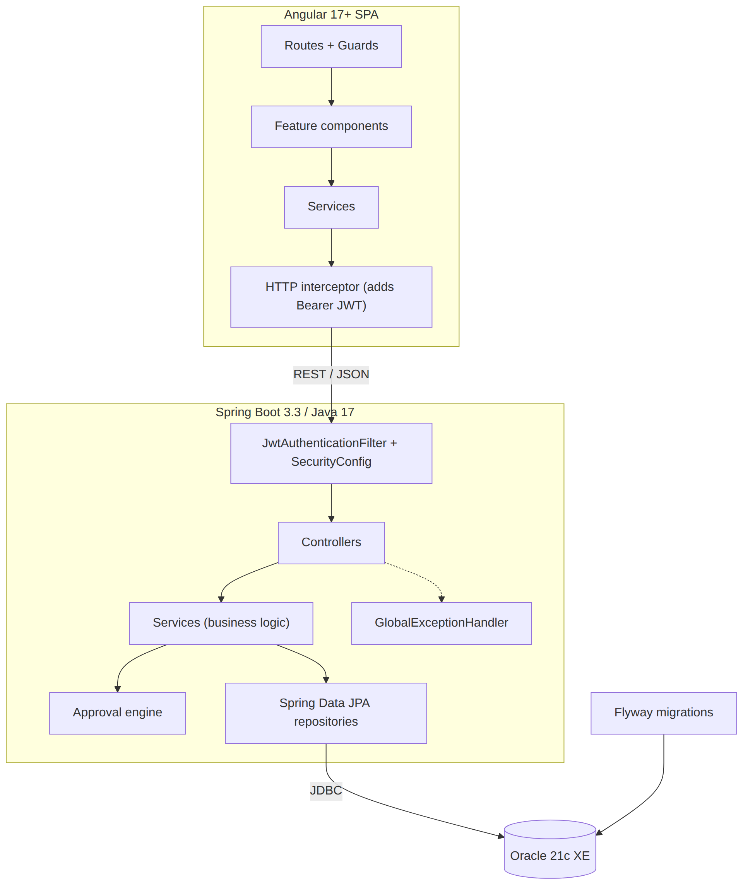

**Backend layering:** Controller → Service → Repository, DTOs at the API boundary, one package per module under `com.ordercraft` (`auth`, `user`, `customer`, `vendor`, `product`, `bom`, `salesorder`, `purchaseorder`, `inventory`, `invoice`, `payment`, `approval`, `dashboard`, `audit`, `config`, `common`).

**Stack:** Spring Security + JWT, JPA/Hibernate, Springdoc (Swagger at `/swagger-ui.html`), Maven, Angular CLI, iText/JasperReports for PDFs, Chart.js/ngx-charts.

## 3. Module dependencies

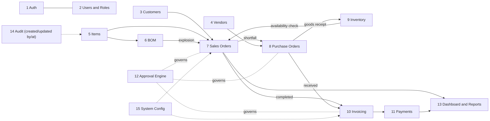

## 4. Entity-relationship diagrams

Every table also carries `created_by / created_at / updated_by / updated_at` referencing `oc_users` (omitted below for clarity). Only key columns are shown; full column lists are in `PROJECT_MODULES.md`.

### 4.1 Identity and access

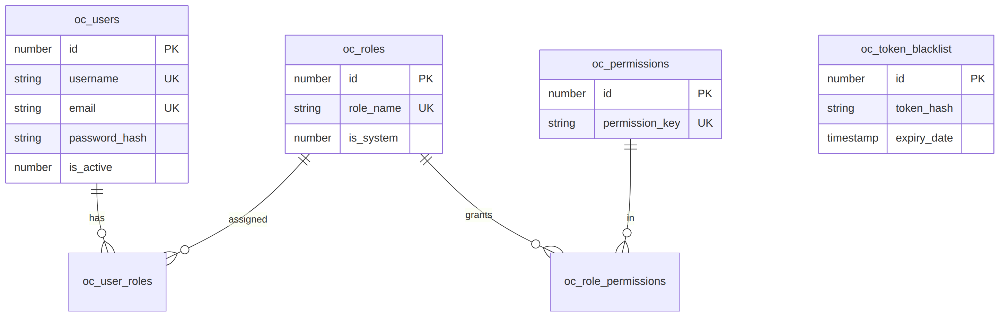

### 4.2 Orders, BOM, procurement and inventory

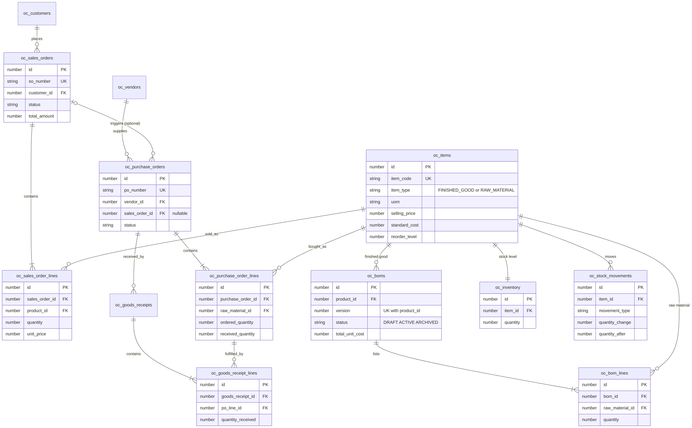

### 4.3 Finance and approvals

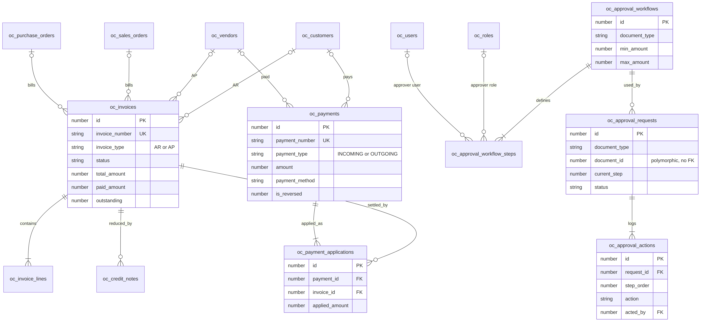

**Configuration tables** (standalone, no FKs): `oc_system_config`, `oc_payment_terms`, `oc_uom`, `oc_categories`, `oc_number_sequences`.

## 5. Order-to-cash flowchart

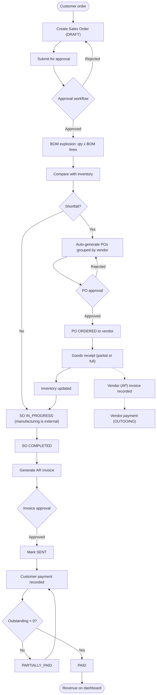

## 6. State machines

Transitions are exactly those in the spec unless marked ⚠ (inferred).

### 6.1 Sales order

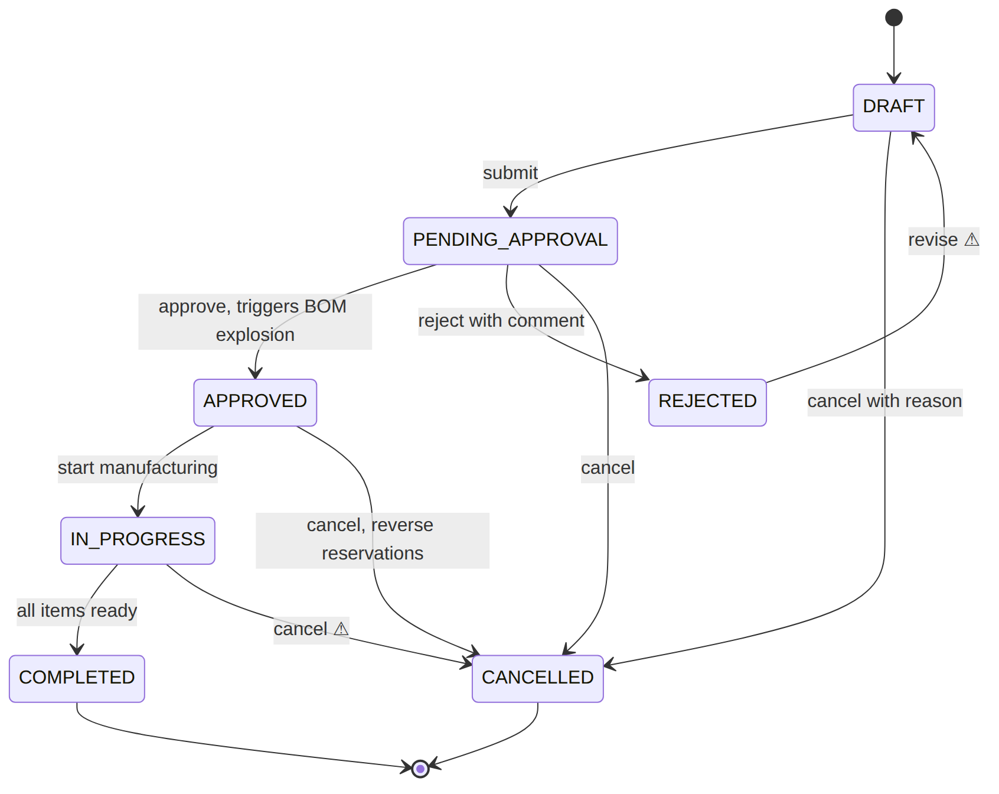

Editable only in `DRAFT` / `PENDING_APPROVAL`; locked after `APPROVED`.

### 6.2 Purchase order

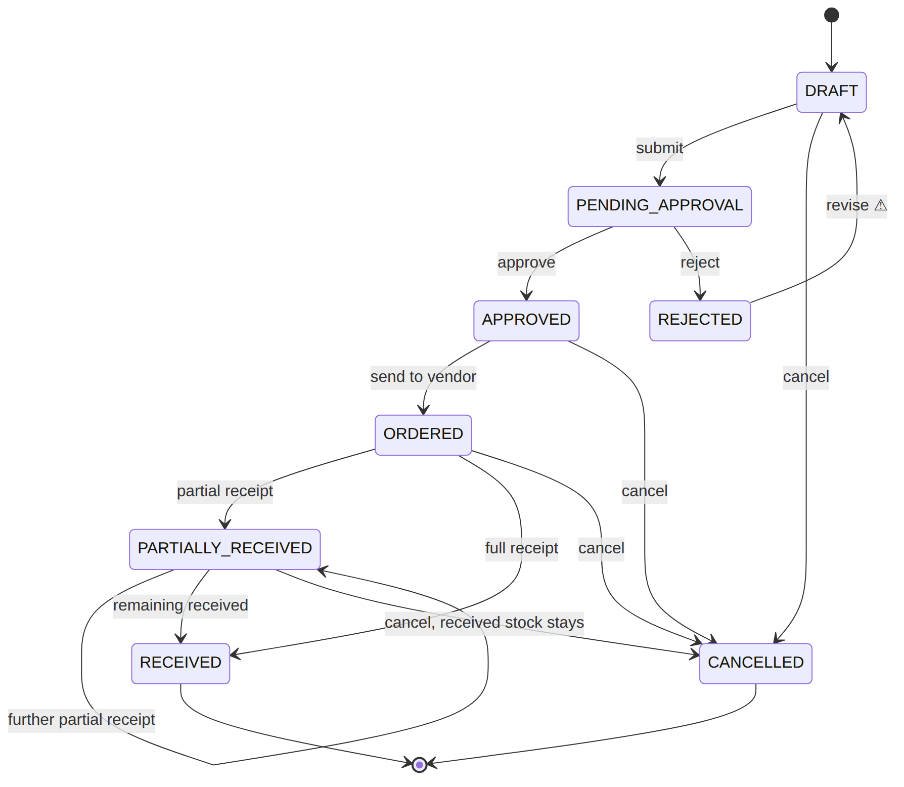

### 6.3 Invoice (AR and AP)

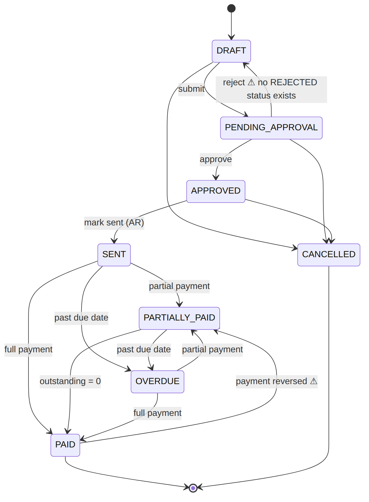

For AP invoices the `SENT` step is not meaningful ⚠; payment presumably starts from `APPROVED`.

### 6.4 BOM

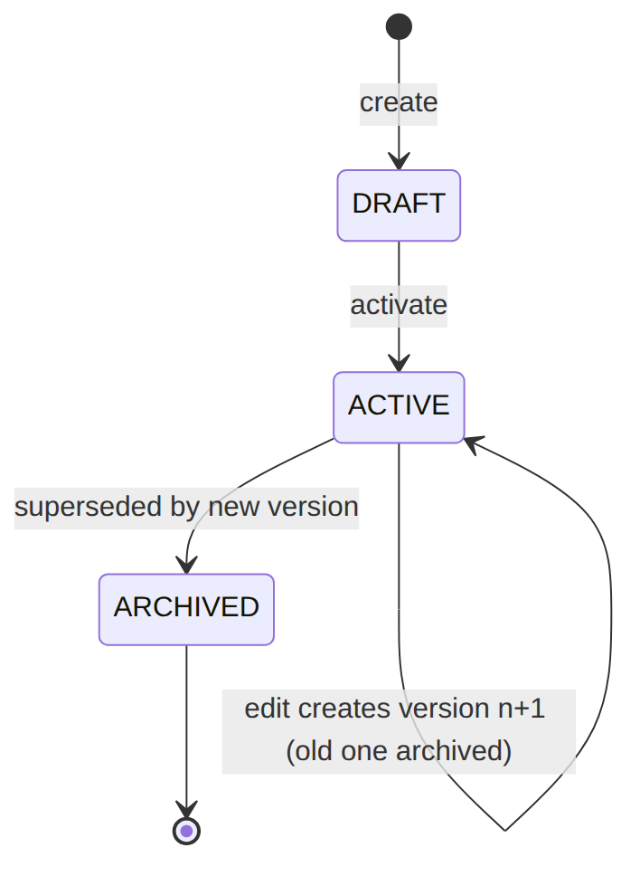

### 6.5 Approval request

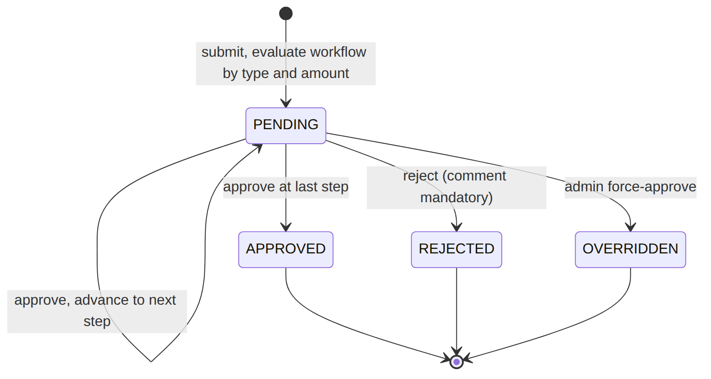

If no workflow matches, or the document is below the minimum threshold, it is auto-approved (spec: optional).

## 7. Key sequences

### 7.1 Authentication (implemented)

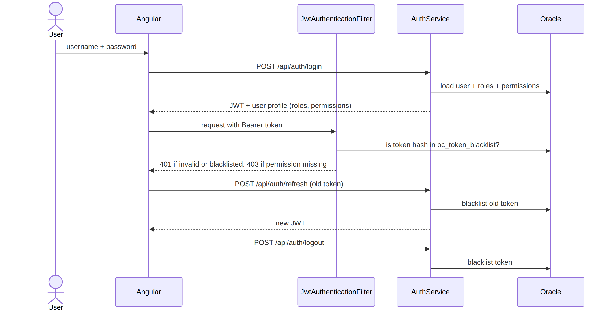

### 7.2 Sales order approval to procurement

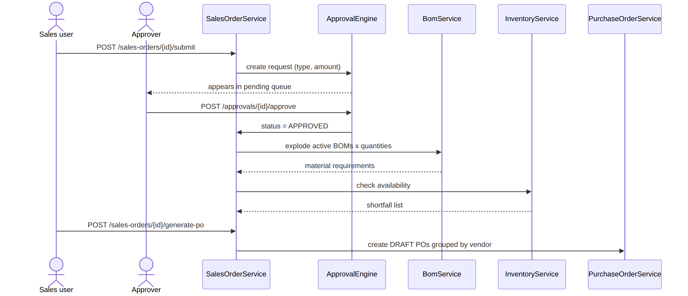

### 7.3 Payment application

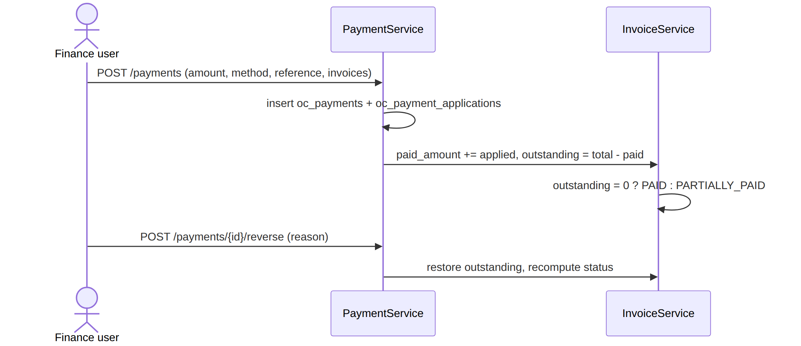

## 8. Roles and permissions

Two seed roles: **Admin** (all permissions) and **General User** (configurable). Custom roles allowed; `is_system = 1` roles cannot be deleted.

| Area | Permission keys | General User default |
|---|---|:-:|
| Users / roles | `USER_MANAGE`, `ROLE_MANAGE` | ❌ |
| Customers, vendors, products | `CUSTOMER_VIEW`, `VENDOR_VIEW`, `PRODUCT_VIEW` | ✅ |
| | `CUSTOMER_MANAGE`, `VENDOR_MANAGE`, `PRODUCT_MANAGE` | ❌ |
| Sales orders | `SO_VIEW`, `SO_CREATE`, `SO_EDIT` | ✅ |
| | `SO_APPROVE` | ❌ |
| Purchase orders | `PO_VIEW` | ✅ |
| | `PO_CREATE`, `PO_APPROVE` | ❌ |
| Inventory | `INVENTORY_VIEW` | ✅ |
| | `INVENTORY_ADJUST` | ❌ |
| Invoices / payments | `INVOICE_VIEW`, `PAYMENT_VIEW` | ✅ |
| | `INVOICE_CREATE`, `PAYMENT_RECORD` | ❌ |
| Dashboard / reports | `DASHBOARD_VIEW`, `REPORT_EXPORT` | ✅ |
| Admin | `APPROVAL_CONFIG`, `CONFIG_MANAGE`, `AUDIT_VIEW` | ❌ |

## 9. API reference (summary)

Base path `/api`, kebab-case URLs, JSON, `Authorization: Bearer <jwt>`. Pagination `?page=0&size=20&sort=createdAt,desc`; search `?q=`.

| Module | Main endpoints |
|---|---|
| Auth ✅ | `POST /auth/login`, `/auth/refresh`, `/auth/logout`, `/auth/reset-password` (`USER_MANAGE`) |
| Users / roles | `/users` (+ `/{id}`, `/{id}/status`, `/me`), `/roles`, `/permissions` |
| Customers / vendors | `/customers`, `/vendors` (+ `/{id}/status`, `/{id}/orders` or `/purchase-orders`, `/search`) |
| Items | `/items` (+ `/finished-goods`, `/raw-materials`, `/{id}/where-used`, `/search`) |
| BOM | `/boms`, `/boms/{id}/copy`, `/explode`, `/versions`, `/boms/product/{productId}` |
| Sales orders | `/sales-orders` (+ `/submit`, `/material-requirements`, `/shortfall`, `/generate-po`, `/generate-invoice`, `/pdf`) |
| Purchase orders | `/purchase-orders` (+ `/submit`, `/receive`, `/receipts`, `/pdf`) |
| Inventory | `/inventory`, `/{itemId}/adjust`, `/{itemId}/history`, `/low-stock`, `/valuation`, `/check-availability` |
| Invoices | `/invoices` (+ `/submit`, `/credit-note`, `/pdf`, `/overdue`, `/aging`) |
| Payments | `/payments` (+ `/{id}/reverse`, `/customer/{id}`, `/vendor/{id}`, `/invoice/{id}`, `/summary`) |
| Approvals | `/approvals/pending`, `/history/{docType}/{id}`, `/{id}/approve`, `/reject`, `/override`; `/approval-workflows` CRUD |
| Dashboard / reports | `/dashboard/*` (11 widgets), `/reports/*` (8 reports, PDF/CSV) |
| Config | `/config`, `/config/tax`, `/company`, `/payment-terms`, `/uoms`, `/categories`, `/sequences` |

**Response envelopes:** success `{data, message}`; paged `{data[], page, size, totalElements, totalPages}`; error `{error, message, details[], timestamp}`.
**Status codes:** 200, 201, 204, 400 validation, 401 no/invalid token, 403 missing permission, 404, 409 duplicate or invalid state transition, 500.

## 10. Business rules and non-functional requirements

- **Numbering:** `CUST-0001`, `VEND-0001`, `FG-0001` / `RM-0001`, `SO-2026-0001`, `PO-`, `INV-` (AR) / `VINV-` (AP), `CN-`, `PAY-`; prefix, year inclusion and next number are configurable.
- **Tax:** default 18% GST on SO, PO and invoices; configurable.
- **Items:** `FINISHED_GOOD` (has selling price) vs `RAW_MATERIAL` (has standard cost); inactive items cannot be added to new orders or BOMs.
- **BOM:** flat, single-level; one active version per finished good; cost = Σ(qty × standard cost).
- **Integrity:** unique (order, product) per line, unique (BOM, material), soft deletes, transactions for multi-table operations, optimistic locking.
- **Overdue:** the system flags invoices past their due date as `OVERDUE`.
- **NFRs:** CRUD under 500 ms, dashboard under 2 s, 100 concurrent users, 10,000+ orders/year, 99.5% uptime, bcrypt, HTTPS in production, JUnit 5 + Mockito, Jasmine/Karma.

## 11. Gaps and open questions in the source docs

1. **Invoice rejection:** the workflow says rejected documents return to the submitter, but the invoice status enum has no `REJECTED`.
2. **SO/PO revision path:** `REJECTED` has no outgoing transition in the spec; `REJECTED → DRAFT` is assumed.
3. **Cancellation rules:** the SO/PO lifecycle diagrams show cancellation only ambiguously (which source states are allowed).
4. **AP invoice lifecycle** reuses AR statuses including `SENT`.
5. **Payment reversal** effect on invoice status is described only as "outstanding restored".
6. **`SO_CONSUMPTION` stock movement** exists in the schema, but no use case consumes stock (manufacturing is external, no reservation table despite "reverse reservations" on cancel).
7. **Polymorphic approval link:** `oc_approval_requests.document_id` has no FK; integrity is enforced in code only.
8. **Audit base class:** spec names `AuditableEntity` (`Instant` fields); code has `BaseEntity` + `AuditEntityListener`.
9. **Refresh endpoint** is unauthenticated (token in body), and the spec says password reset forces a change on next login, which the README flow does not show.
10. **Password terms:** default `admin / Admin@123` and DB credentials in the README must be changed for any non-local deployment.
